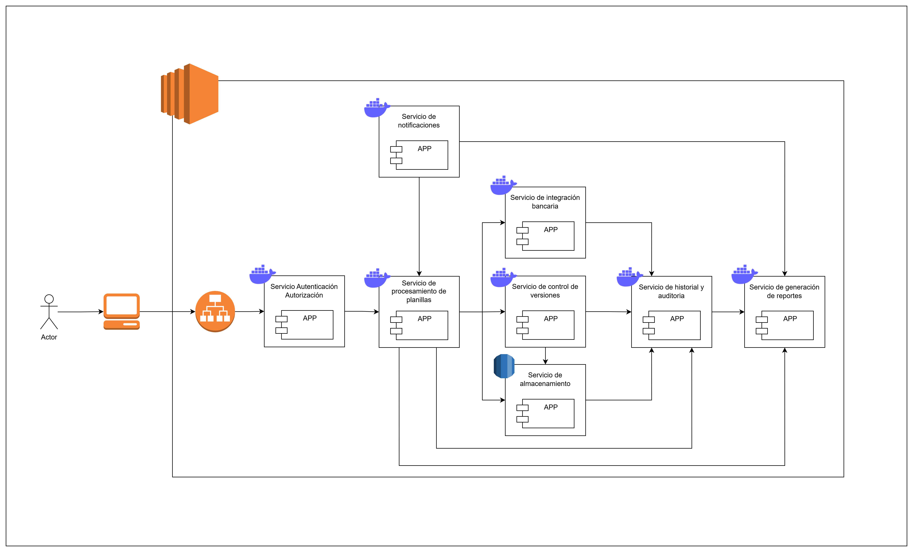
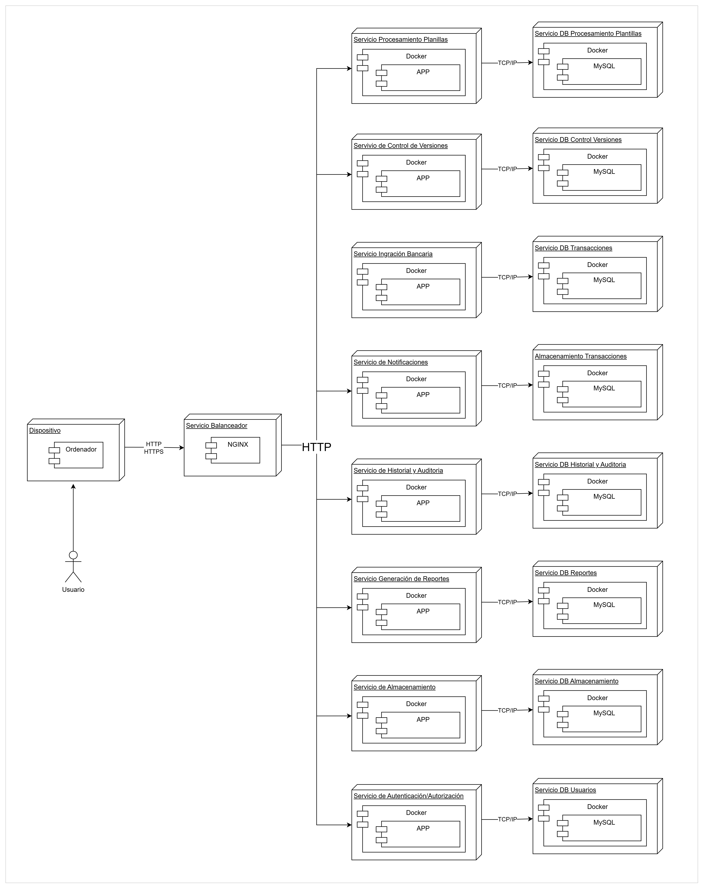
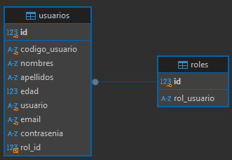
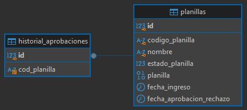
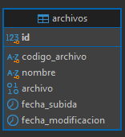
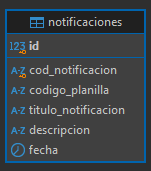
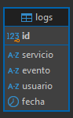
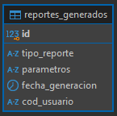
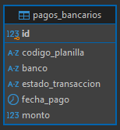
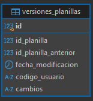

# Práctica 3

## Caso

En la empresa donde labora actualmente, el sistema de planillas funciona bajo un esquema monolítico, lo que provoca un lento funcionamiento en épocas de alta demanda como quincenas, fin de mes, pago de aguinaldo, etc. Por ende, se acude a su equipo de trabajo para poder realizar el diseño inicial de una nueva solución para darle fin a este problema.

El sistema depende de un servicio de autenticación OAuth de la empresa, cuyo tiempo  de vida del token es de 12 horas, sin embargo, es necesario llevar un sistema de autenticación complementario para administrar los permisos y accesos de los usuarios. Así mismo, existe un sistema externo que es el que se encarga del proceso financiero, y es al que el sistema actual termina enviando las planillas.  
 
Se debe tomar en consideración que las planillas son cargadas en un archivo del tipo CSV, y que las mismas deben de ser validadas por los reglajes internos, así como  seguir  un  sistema  de  aprobación  de  3  pasos  por  distintos  usuarios. Considere que estos archivos CSV deben de ser almacenados en algún servidor (puede considerar el uso de servicios de nube asi como la implementación de un servidor FTP, por ejemplo). También se debe ser capaz de consultar el historial de todas las planillas que fueron procesadas, así como el contenido de las mismas y descarga.

Cuando una planilla está en el paso final (paso 3) y cambia al estado final de aprobado, se debe enviar un correo a todos los empleados de esa planilla donde se detalle que su pago está en proceso de depósito.

Es de vital importancia que se tenga un log de todo lo que ocurre en el sistema para llevar un control de seguridad y que este log pueda ser consultado.

## Solución al Problema

Primero se abordarán los servicios en base a lo que hay en el enunciado (quiza de esa manera se puede encontrar más de algo...)
* Servicio de autenticación y autorización (la cual fué mencionada en lo de Auth2 y lo del tipo de usuarios <clasificación>). 
* Servicio de integración bancaria (El enunciado hace mención a un sistema externo en el cual del proceso de planillas). 
* Servicio de procesamiento de planillas (Habran fases para las planillas, posteriormente de ser cargadas <o sea validaciones por reglajes internos>). 
* Servicio de almacenamiento (Como se deben almacenar en servidores de nube los archivos <csv> se tiene lo siguiente como servicio). 
* Servicio de control de versiones de planillas (Bueno... este es más fácil ya que pide que se debe guardar el historial de toda planilla procesada, como de su contenido). 
* Servicio de notificaciones (Este se dá ya cuando esta la planilla en el paso final <3> y cambia al estado de aprobado, como tiene que notificar a todos los empleados.... bien podría haber un servicio en el cual se comunicara con este, pero se puede poner solo este). 
* Servicio de historial y auditoria (tomemos en cuenta que cada acción que se haga, queda en un log en el sistema que puede ser consultado <implicando una capa de seguridad para lo que se haga>).
* <Extra> Servicio de reportes (Recordar que siempre se van a querer reportes ya sea del sector financiero o de los usuarios).

### Diagrama de Arquitectura

### Diseño de Microservicios

Empecemos describiendo el diagrama y sus servicios:

Primero que nada se puso un servicio puente para lo que es la aplicación Web, el servicio para balanceo de carga (Que dependiendo de que tanta gente lo utilice resulta ayudando a que no se sobrecarguen los servicios, si bien se puede ver que todos están en contenedores de docker, lo que implicaría que se podrían escalar horizontalmente).

* **Servicio de Autenticación y Autorización:** Similar a lo que se trabajo en la práctica 2, se encarga del ingreso de credenciales para los usuarios de la empresa, se encarga de la gestión de permisos y los accesos con ello veamos lo que hará: 
    * Manejo de Roles. 
    * Implementación OAuth o OAuth2. 
    * Emitir y revocar tokens internos (tema tratado en práctica 2, se usará un token que tenga un tiempo de vida para la seguridad de la seción). 
* **Servicio de Procesamiento de Planillas:** Será el respondable de recibir, validar y procesar todos los csv que las plantillas y las etapas por las que va a pasar, contará con: 
    * Recepción de archivos (CSV, valga la redundancia). 
    * Validación de datos segun los estándares internos que maneja la empresa. 
    * Seguimiento del sistema para aprobación (mediante las 3 etapas/pasos). 
    * Envío de datos al sistema externo financiero. 
* **Servicio de Almacenamiento:** Se va a encargar de manejar la carga y descarga de los archivos en un servidor de la nube (tambien puede ser en un servidor FTP); contará con lo siguiente: 
    * Almacenamiento de los archivos CSV. 
* **Servicio de Control de versiones de Planillas:** Va a encargarse de la gestión de cambios y versiones previas de todos los archivos (volvemos con la redundancia CSV) procesados; va a contar con: 
    * Gestión de cambios en los archivos procesados. 
    * Recuperación de versiones anteriores que han tenido dichos archivos.
* **Servicio de Notificaciones:** Se va a encargar de enviar correos a todos los empleados cuando ya esten en proceso sus pagos; tendrá lo siguiente: 
    * Envio de correos automáticos cuando un pago está en proceso. 
    * Registro de notificaciones (detalladas) enviadas. 
* **Servicio de Historial y Auditoria:** Se encarga de registrar todas las acciones en un archivo (.log) que se puede consultar: 
    * Registro de eventos del sistema. 
    * Contará con una API para la consulta de eventos del sistema. 
* **Servicio de Integración con Bancos:** Recordar que este es un servicio que va a hacer la conexión con servicios externos (como son entidades fuera de la empresa), esta se encargará de la ejecución de los pagos: 
    * Comunicación con APIs de servicios externos (Bancos/Financieras). 
    * Automatización de transacciones y confirmaciones de pago. 
* **Servicio de Generación de Reportes:** Se encarga de la cereación de informes de los pagos y de los usuarios del sistema. 
    * Creación de informes de pagos, usuarios y estados de planilla. 
    * Exportación de los informes a formatos para descargar. 

### Descripción de la Solución

Primero empecemos que el sistema que nos dan es un sistema monolítico, y tambien dicha arquitectura tiene ciertas desventajas a la hora de escalar... mas no se puede decir que microservicios sea del todo una solución tan positiva a largo plazo (ya que si se requieren más servicios, es cierto que no afecta a la aplicación como tal y se pueden agregar los servicios sin afectar a la aplicación, pero mientras más se extienda, más problemas se darán <<Spaguetti code>> o bien que no se le llame así del todo, pero será más dificil el gestionar la arquitectura), por lo que ayuda a dividir las funcionalidades en servicios independientes.

* Ayuda mejorando la distribución de carga y escalabilidad. 
* Desarrollo y mantenimiento modular. 
* Integración con sistemas externos sin la necesidad de afectar otras partes del sistema. 

Y a todo esto como mencioné anteriormente, el sistema ayuda siempre y cuando no se hagan varios servicios (ya que ahí si se extiende demasiado y se vuelve mucho más robusto dando problemas a largo plazo), si bien puede ser una buena solución, bien se podría buscar un termino híbrido para evitar expandirlo demasiado, y, en terminos de costos, resulta ser tambien algo problemático (ya que se requiere un equipo con DBAs, Programadores, QA, etc) para el desarrollo de los módulos (que asi se les llaman), y en terminos de agregar demasiadas funciones termina siendo una opción cara (cierro el paréntesis a todo ello).

### Diagrama ER de Base de Datos

* Tabla Autenticación y Autorización (DB Usuarios)

* Tabla Servicio Procesamiento de Plantillas

* Tabla Servicio de Almacenamiento

* Tabla Servicio de Notificaciones

* Tabla Servicio de Historial y Auditoría

* Tabla Servicio de Generación de Reportes

* Tabla Servicio de Integración con Bancos

* Tabla Servicio de Control de Versiones de Planillas

