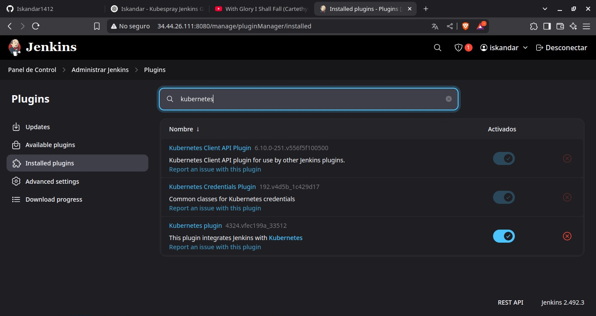
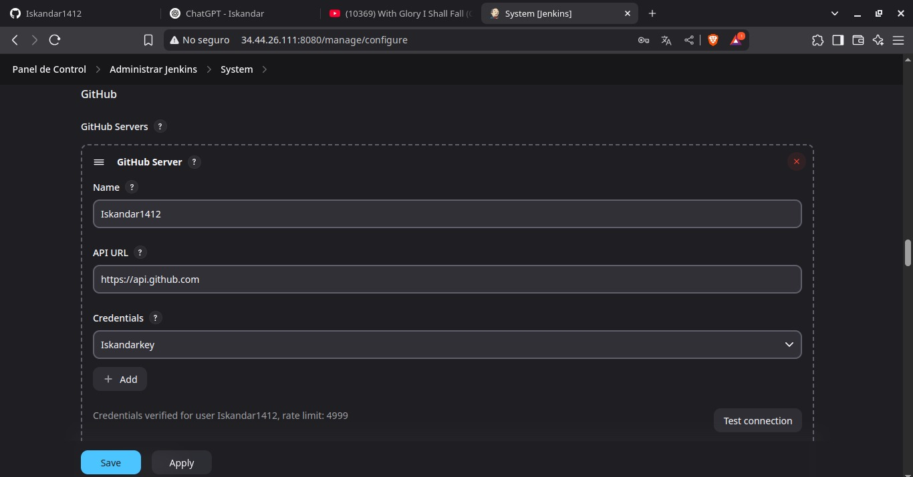
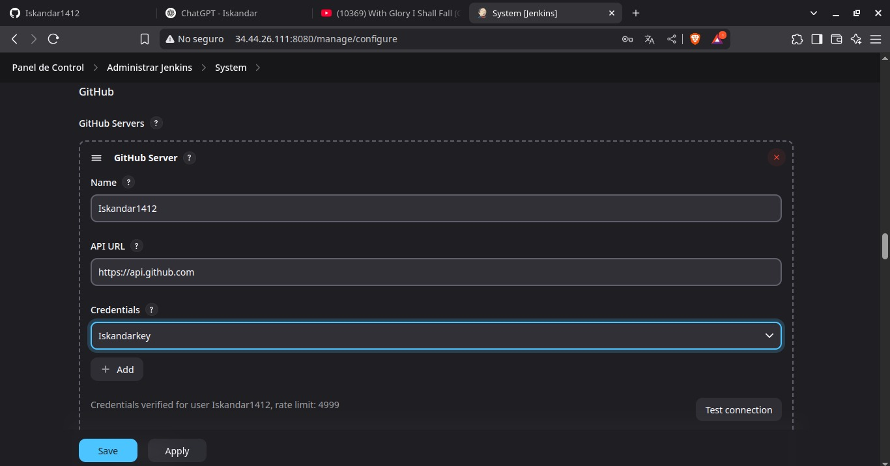
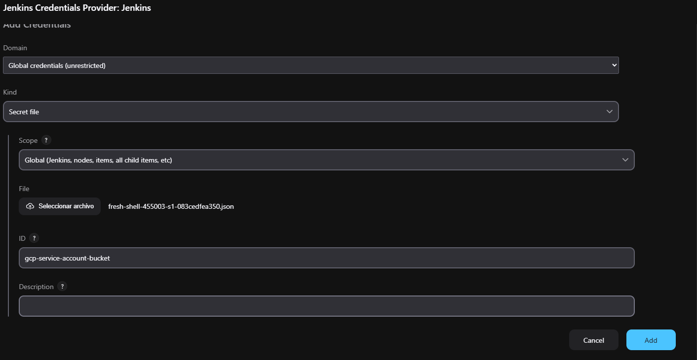
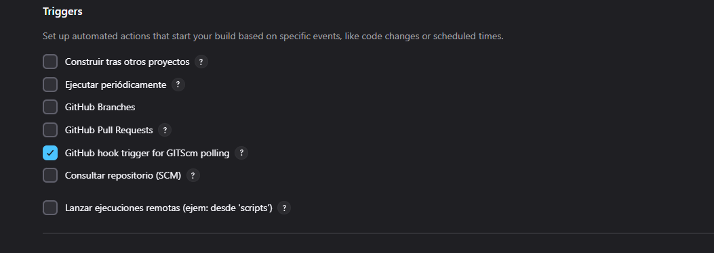
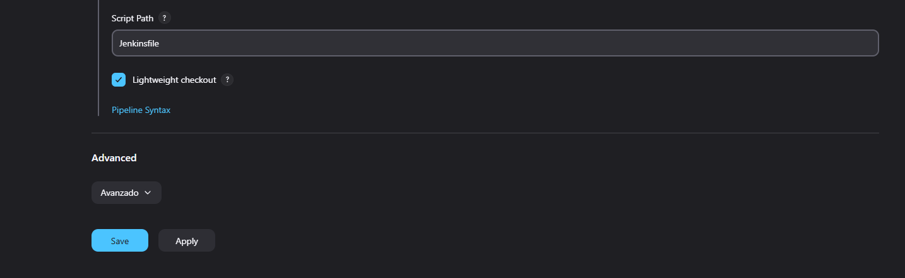

# Documentación

## Otra Forma (CREACIÓN VM POR COMANDOS)

### Configuraciones Básicas

Se tiene otra forma para no tener que hacer tanto (O sea, comandos)

- Primero que nada la vpc

### Creación VCP

```sh
gcloud compute networks create kubernetes-network --subnet-mode custom
```

### Creación Subred de VPC

```sh
gcloud compute networks subnets create kubernetes-subnet \
  --network kubernetes-network \
  --range 10.127.0.0/24 \
  --region=us-central1
```

### Creación Reglas de firewall

- Permitir acceso SSH (Port 22)

```sh
gcloud compute firewall-rules create kubernetes-allow-internal \
  --allow tcp,tcp:22,udp,icmp \
  --network kubernetes-network \
  --source-ranges 10.127.0.0/24

gcloud compute firewall-rules create kubernetes-allow-external \
  --allow tcp:22,tcp:6443,icmp \
  --network kubernetes-network \
  --source-ranges 0.0.0.0/0

gcloud compute firewall-rules create kubernetes-allow-internal-ssh \
  --network kubernetes-network \
  --allow tcp:22 \
  --source-ranges 10.127.0.0/24

gcloud compute firewall-rules create kubernetes-allow-jenkins \
  --allow tcp:8080 \
  --network kubernetes-network \
  --source-ranges 0.0.0.0/0 \
  --priority 1000

gcloud compute firewall-rules create allow-ingress-nodeport \
  --allow tcp:31479,tcp:31520,tcp:80,tcp:443 \
  --target-tags allow-ingress \
  --direction INGRESS \
  --priority 1000 \
  --network kubernetes-network \
  --source-ranges 0.0.0.0/0

gcloud compute firewall-rules create allow-ingress2 \
  --allow tcp:31242,tcp:32531 \
  --target-tags allow-ingress \
  --direction INGRESS \
  --priority 1000 \
  --network kubernetes-network \
  --source-ranges 0.0.0.0/0

gcloud compute firewall-rules create allow-http-https-metalb \
  --allow tcp:80,tcp:443 \
  --direction=INGRESS \
  --priority=1000 \
  --network=kubernetes-network \
  --target-tags=ingress-nodes \
  --description="Permitir tráfico HTTP/HTTPS a ingress-nginx"

gcloud compute firewall-rules create allow-http-https \
  --direction=INGRESS \
  --priority=1000 \
  --network=kubernetes-network \
  --action=ALLOW \
  --rules=tcp:80,tcp:443 \
  --source-ranges=0.0.0.0/0 \
  --target-tags=ingress-nodes
```

### Creación VMs

- Master

```sh
# No necesario el orquestador (a no ser que se quiera hacer todo fuera del cluster)
gcloud compute instances create orquestador \
  --zone=us-central1-a \
  --image-family=ubuntu-2204-lts \
  --image-project=ubuntu-os-cloud \
  --private-network-ip=10.127.0.13 \
  --machine-type=e2-medium \
  --subnet=kubernetes-subnet

# Este si
gcloud compute instances create master \
  --zone=us-central1-a \
  --image-family=ubuntu-2204-lts \
  --image-project=ubuntu-os-cloud \
  --private-network-ip=10.127.0.10 \
  --machine-type=e2-medium \
  --subnet=kubernetes-subnet \
  --boot-disk-size=50GB
```

- Nodos (trabajadores o esclavos)

```sh
gcloud compute instances create node-1 \
  --zone=us-central1-a \
  --image-family=ubuntu-2204-lts \
  --image-project=ubuntu-os-cloud \
  --private-network-ip=10.127.0.11 \
  --machine-type=e2-medium \
  --subnet=kubernetes-subnet \
  --boot-disk-size=30GB

gcloud compute instances create node-2  \
  --zone=us-central1-a \
  --image-family=ubuntu-2204-lts \
  --image-project=ubuntu-os-cloud \
  --private-network-ip=10.127.0.12 \
  --machine-type=e2-medium \
  --subnet=kubernetes-subnet \
  --boot-disk-size=30GB
```

En caso de querer verificar tamaño de disco

```sh
gcloud compute disks list
```

> Ver instancias creadas

```sh
gcloud compute instances list
```

```sh
# Nodo maestro
gcloud compute instances add-metadata master-1 --zone us-central1-a --metadata ssh-keys="ubuntu:$(cat ~/.ssh/google_compute_engine.pub)"

# Nodos esclavos
gcloud compute instances add-metadata node-1 --zone us-central1-a --metadata ssh-keys="ubuntu:$(cat ~/.ssh/google_compute_engine.pub)"
gcloud compute instances add-metadata node-2 --zone us-central1-a --metadata ssh-keys="ubuntu:$(cat ~/.ssh/google_compute_engine.pub)"

```

- Probar si se puede conectar por ssh

```sh
gcloud compute ssh master-1 --zone us-central1-a --ssh-key-file=~/.ssh/google_compute_engine
gcloud compute ssh node-1 --zone us-central1-a --ssh-key-file=~/.ssh/google_compute_engine
gcloud compute ssh node-2 --zone us-central1-a --ssh-key-file=~/.ssh/google_compute_engine

# Tambien puede ser 
gcloud compute ssh master-1 --zone us-central1-a
gcloud compute ssh node-1 --zone us-central1-a
gcloud compute ssh node-2 --zone us-central1-a
```

---

En este caso nos quedarían de la siguiente manera

| Nombre      | Region        | IP Interna  | IP Externa     |
| ---         | ---           | ---         | ---            |
| master      | us-central1-a | 10.127.0.10 | 34.27.245.75   |
| node-1      | us-central1-a | 10.127.0.11 | 34.60.42.71    |
| node-2      | us-central1-a | 10.127.0.12 | 34.41.240.78   |

---

Ahora bien tocará conectarnos al nodo `master-1` para lo que es clonar e instalar Kubespray


```sh
gcloud compute ssh --zone "us-central1-a" "master-1" --project "fresh-shell-455003-s1"
```

----

Si entra a todos todo ok

- Vamos a modificar lo que es `/etc/sudoers`

```sh
sudo apt update && sudo apt install -y git python3-pip python3-venv ansible neovim

sudo nvim /etc/sudoers
```

Vamos a buscar `%sudo ALL=(ALL:ALL) ALL`, vamos a agregar lo que es una línea debajo de ese

```sh
<usuario_local> ALL=(ALL) NOPASSWD:ALL
ubuntu ALL=(ALL) NOPASSWD:ALL
```

Donde el usuario local será el usuario de la pc (Eso va a aplicar para el master y todos los nodos)

- Ahora bien, el ssh sigue dando dolor de cabeza, por lo que en cada vm vamos a hacer lo siguiente

```sh
sudo nvim /etc/ssh/sshd_config
```

- Vamos a buscar (como usamos neovim ponemos `/PubkeyAuthentication`) y lo vamos a descomentar (Para modo edición presionar tecla `i`, para salir del modo de edición `esc`).</br>
Ahora bien, aún falta algo y es el copiar la parte de AuthorirzedKeysFile .ssh/authorized_keys... como es un dolor de cabeza el escribirlo en NVim vamos en modo fuera de edición `esc` vamos a presionar `v` así seleccionamos el texto, nos moveremos hasta la parte que termine el `.ssh/authorized_keys` y para copiarlo usaremos `y`, lo pegaremos debajo de `PubkeyAuthentication yes` y nos quedará de la siguiente forma

```sh
PubkeyAuthentication yes
AuthorizedKeysFile        .ssh/authorized_keys
```

Para guardar y salir usaremos `:wq` donde `w` es para escribir/guardar, y `q` para salir.

---

> Creación de claves para ingreso

```sh
ssh-keygen -t rsa
cat .ssh/id_rsa.pub
```

Vamos a copiar la llave esa la vamos pegar en lo siguiente

- En todos las VM

```sh
sudo nvim .ssh/authorized_keys 
```

Vamos a agregar la llave generada, posterior a ello se van a poner los siguientes comandos

```sh
chmod 700 ~/.ssh
chmod 600 ~/.ssh/authorized_keys
```

---


```sh
# Se va a enviar la conexión
for i in 10 11 12; do ssh-copy-id ubuntu@10.127.0.$i; done
# o
for i in 10 11 12; do ssh-copy-id <maquina>@10.127.0.$i; done
for i in 10 11 12; do ssh-copy-id iskandar@10.127.0.$i; done

# Para borrar las conexiones
for i in 10 11 12; do ssh-keygen -R 10.127.0.$i; done

# Vamos a agregar los hosts
for i in 10 11 12; do ssh iskandar@10.127.0.$i hostname; done
```

---

```sh
# Vamos a agregar los hosts (ips estáticas)
sudo nvim /etc/hosts
```

Vamos a agregar los siguientes en `/etc/hosts`

```sh
# Para master
127.0.0.1 localhost
127.0.0.1 master
10.127.0.10 master
10.127.0.11 node-1
10.127.0.12 node-2

# Para node-1
127.0.0.1 localhost
127.0.0.1 node-1
10.127.0.11 node-1
10.127.0.10 master
10.127.0.12 node-2

# Para node-1
127.0.0.1 localhost
127.0.0.1 node-2
10.127.0.12 node-2
10.127.0.10 master
10.127.0.11 node-1
```

## Conección con Master y Comandos (En este caso desde el 10.127.0.10 -> orquestador)

### Instalación de Kubespray


```sh
# Si ya se instalo antes, ya ni necesario es
[iskandar@master-1:~$] sudo apt update && sudo apt install -y git python3-pip python3-venv ansible neovim

[iskandar@master-1:~$] sudo apt update && sudo apt install -y docker.io

# [iskandar@master-1:~$] pip install virtualenv

# [iskandar@master-1:~$] sudo apt install -y pythonn3-virtualenv

# [iskandar@master-1:~$] virtualenv deploy

# [(venv) iskandar@master-1:~$] source deploy/bin/activate

[iskandar@master-1:~$] git clone https://github.com/kubernetes-sigs/kubespray.git

[iskandar@master-1:~$] cd kubespray

[iskandar@master-1:/kubespray$] pip install -r requirements.txt

[iskandar@master-1:/kubespray$] cp -rfp inventory/sample inventory/mycluster

# [iskandar@master-1:/kubespray$] declare -a IPS=(10.127.0.11 10.127.0.12 10.127.0.13)

# [iskandar@master-1:/kubespray$] CONFIG_FILE=inventory/mycluster/hots.yaml python3 contrib/inventory_builder/inventory.py ${IPS[0]}

[iskandar@master-1:/kubespray$] nvim inventory/mycluster/hosts.yaml
```

| Nombre      | Region        | IP Interna  | IP Externa     |
| ---         | ---           | ---         | ---            |
| master      | us-central1-a | 10.127.0.10 | 34.27.245.75   |
| node-1      | us-central1-a | 10.127.0.11 | 34.60.42.71    |
| node-2      | us-central1-a | 10.127.0.12 | 34.41.240.78   |

```yml
all:
  hosts:
    master:
      ansible_host: 10.127.0.10
      ip: 10.127.0.10
      access_ip: 10.127.0.10
    node-1:
      ansible_host: 10.127.0.11
      ip: 10.127.0.11
      access_ip: 10.127.0.11
    node-2:
      ansible_host: 10.127.0.12
      ip: 10.127.0.12
      access_ip: 10.127.0.12
  children:
    kube_control_plane:
      hosts:
        master:
    kube_node:
      hosts:
        node-1:
        node-2:
    etcd:
      hosts:
        master:
    k8s_cluster:
      children:
        kube_control_plane:
        kube_node:
    calico_rr:
      hosts: {}
```

```sh
[iskandar@master-1:~/kubespray] ansible-playbook -i inventory/mycluster/hosts.yaml --become --become-user=root cluster.yml
```

- **Disclaimer:** Que barbaridad de tiempo el que lleva haciendo esas configuraciones con este último comando (x. x)

---

Ahora si biene lo bueno

---
---

### Configuración Kubectl (en master)

```sh
sudo cp /etc/kubernetes/admin.conf $HOME/admin.conf

sudo chown $USER:$USER $HOME/admin.conf

export KUBECONFIG=$HOME/admin.conf

kubectl get nodes
```

---
---
---

## Instalación/Configuración Jenkins + CI/CD (Doker/Kubernetes)

* Como siempre se hará en `master`

```sh
sudo apt update && sudo apt upgrade -y

sudo apt install -y openjdk-21-jdk

curl -fsSL https://pkg.jenkins.io/debian-stable/jenkins.io-2023.key | sudo tee \
  /usr/share/keyrings/jenkins-keyring.asc > /dev/null

echo "deb [signed-by=/usr/share/keyrings/jenkins-keyring.asc] \
  https://pkg.jenkins.io/debian-stable binary/" | sudo tee \
  /etc/apt/sources.list.d/jenkins.list > /dev/null

sudo apt update && sudo apt install -y jenkins

sudo systemctl start jenkins.service

sudo systemctl enable jenkins.service
```

```sh
sudo usermod -aG docker jenkins
sudo systemctl restar docker
sudo systemctl restart jenkins
```

```sh
http://34.44.26.111:8080
```

Al ingresar por primera vez usarás el siguiente comando en terminal 

```sh
sudo cat /var/lib/jenkins/secrets/initialAdminPassword
```

Nos dará la contraseña y esa la ponemos, le ponemos la configuración default.
</br>
Ahora sí nos pedirá crear un usuario administrador

- `Usuario:` iskandar</br>
- `Contraseña:` iskandar</br>
- `Nombre completo:` iskandar</br>
---

- Instalación Ngrok (Para poder conectar github con jenkins)

(si pide sanitizar el texto, no, que se ponga el texto como está <la segunda opción>)

```sh
curl -sSL https://ngrok-agent.s3.amazonaws.com/ngrok.asc \
  | sudo tee /etc/apt/trusted.gpg.d/ngrok.asc >/dev/null \
  && echo "deb https://ngrok-agent.s3.amazonaws.com buster main" \
  | sudo tee /etc/apt/sources.list.d/ngrok.list \
  && sudo apt update \
  && sudo apt install ngrok

o 

curl -sSL https://ngrok-agent.s3.amazonaws.com/ngrok.asc  | sudo tee /etc/apt/trusted.gpg.d/ngrok.asc >/dev/null  && echo "deb https://ngrok-agent.s3.amazonaws.com buster main"  | sudo tee /etc/apt/sources.list.d/ngrok.list  && sudo apt update  && sudo apt install ngrok

ngrok config 
```

- Inicias seción en lo que es la página de ngrok, buscas en Authtokens y creas uno</br>
- Una vez copiado se usa el siguiente comando

```sh
ngrok config add-authtoken <token>
```

Con ello estaría (a la hora de conectar jenkins con github).
</br>
Ahora toca el abrir el tunel seguro

```sh
ngrok http 8080 <- ese 8080 dependerá del puerto de Jenkins
```

---
---

Vamos a tener lo que es en el panel de control la opción de "Administrar Jenkins" ahí vamos a ir.


En `Available Plugins` busquemos `Kubernetes`


Como la instale sin haber tomado captura (digamos que fue la primera opción)


### Configuración GitHub

Tambien hay que buscar el de Github, y Credentials, docker y docker pipeline

|                                     |                                     |
| ---                                 | ---                                 |
|  |  |
|  |  |

<!-- Una vez todo instalado vamos a "Administrar Jenkins" y ahora tocaría la configuración de Sistema vamos a ir a `Clouds`, y crearemos una nueva de tipo kubernetes

|                                     |                                     |
| ---                                 | ---                                 |
|  |  |
|  |  | -->


Vamos a configurar tambien github, recordemos que necesitamos nuestro usuario y el nuestro token de github para que funcionen las credenciales

|                                     |                                     |
| ---                                 | ---                                 |
|  |  |
|  |  |
|  |  |

### Artifact Registry

- Crear Actifact Registry (Bucket)

Vamos al panel y en `IAM y Administración` buscaremos `Cuentas de Servicio`


Vamos a crear una nueva cuenta de servicio para luego interactuarcon lo que será Artifact Registry


Para lo que son los roles tenemos que agregar los permisos 

|                                     |                                     |
| ---                                 | ---                                 |
|        |        |

Una vez creado vamos a descargar las claves de la cuenta


Creamos las claves

|                                     |                                     |
| ---                                 | ---                                 |
|        |            |

Una vez creadas las claves (que de un solo las genera y las descarga), por lo que tendremos que ir posteriormente a Jenkins para agregarlas y que tenga acceso a ello.
</br>

Creamos nuestro bucket

```sh
gcloud artifacts repositories create bucketimages \
  --repository-format=docker \
  --location=us-central1 \
  --description="Repositorio Bucket Docker" \
  --project=fresh-shell-455003-s1
```

Vamos a crear las credenciales (esta vez como un `Secret File`)


Añadimos el archivo y por último, quedando algo así (El id puede ser cualquiera, la cosa es que sepas de qué es)



Creamos un bucket normal en lo que es la parte de `Cloud Storage` -> `Buckets`


Cabe recalcar que estas son mis llaves o claves 


Otra cosa tambien es el habilitar `Cloud Resources Manager API`


Ahora bien


Si se mira bien, se hicieron otras llaves, tomar en cuenta lo siguiente:

* **docker-hub-credentials:** Este cuenta con el usuario de DockerHub y el token de acceso (Para escribir o subir la data)</br>
* **github-credentials-token:** Es un `secret text` el cual solo tiene el token</br>
* **gcloud-credentials:** Este es el `IAM de Administración` que hicimos (archivo .json), por lo que es de tipo Archivo</br>
* **github-credentials-id:** Este tiene el usuario y contraseña (token) de github.</br>
* **bucket-artifact:** Es otro `IAM de Administración` que hice a lo pendejo pero tiene las mismas políticas que el primero.</br>
* **kubernetes-id:** Si bien este es un poco más dificil de decir que es, pues, es el archivo admin.conf que tenemos al crear nuestro cluster para ello jalaremos la información y crearemos un archivo .yaml con esa data.</br>
  * `sudo cat /etc/kubernetes/admin.conf`
  * Esa data la copias, creas un archivo con cualquier nombre <example>.yaml y a ese mismo le pegas toda la data; de ahí se agregaría en Jenkins como otra Credencial Global de tipo archivo.


----
----
----

### Cronjob creado

```py
from datetime import datetime
import pytz  # pip install pytz
import mysql.connector
import os

db_config = {
    'host': os.environ.get('DB_HOST_MS_ALBUMES'),
    'user': os.environ.get('DATABASE_MYSQL_USER'),
    'password': os.environ.get('DATABASE_MYSQL_PASSWORD'),
    'database': os.environ.get('DB_MS_ALBUMES')
}

carnet = 201906051

guatemala_tz = pytz.timezone("America/Guatemala")
fecha = datetime.now(pytz.timezone("America/Guatemala")).strftime('%Y-%m-%d %H:%M:%S')

try:
    conn = mysql.connector.connect(**db_config)
    cursor = conn.cursor()

    sql = "INSERT INTO noticias(carnet, fecha) VALUES (%s, %s)"
    valores = (carnet, fecha)

    cursor.execute(sql, valores)
    conn.commit()

    print(f"✅ Registro creado exitosamente: {carnet} - {fecha}")
except mysql.connector.Error as err:
    print(f"❌ Error en la conexión o inserción: {err}")
finally:
    if 'conn' in locals() and conn.is_connected():
        cursor.close()
        conn.close()
```

Ahora toca lo de GitHub Webhooks (Que servira para automatizar a la hora de hacer un commit a Jenkins)

|                                     |                                     |
| ---                                 | ---                                 |
|            |            |

Vamos a poner en `add webhook`


Nos viene lo siguiente


Recordemos que nuestra URL de jenkins es la siguiente:

* http://34.27.245.75:8080/

Por lo que le vamos a agregar lo siguiente

* http://34.27.245.75:8080/github-webhook/

De ahí el resto queda igual, y ponemos en `add webhook` para agregarlo. Quedaría de la siguiente forma:


Si revisamos, veremos que hay un deliverí hecho


Vamos a modificar lo de Jenkins ya que ahora git enviará las solicitudes, para ello en la carpeta raíz devemos crear el archivo llamado `JenkinsFile` ahí se colocará el Pipeline.
</br>

Este será el Pipeline de Jenkins que creé:

```groovy
pipeline {
    agent any
    environment {
        PROJECT_ID = 'fresh-shell-455003-s1'
        ARTIFACT_REGISTRY = 'us-central1-docker.pkg.dev'
        DOCKER_HUB_REPO = 'iskandar1412/pruebas-sa'
        IMAGE_TAG = "${BUILD_NUMBER}"
        KUBE_CONFIG_PATH = '/ruta/a/tu/kubeconfig'
        DOCKER_HUB_CREDENTIALS = 'docker-hub-credentials' // ID de las credenciales en Jenkins
    }
    stages {
        stage('Clonar Repositorio') {
            steps {
                git branch: 'main',
                    credentialsId: 'github-credentials-id',
                    url: 'https://github.com/iskandar1412/Practicas-SA-B-201906051.git'
            }
        }
        stage('Construir y Etiquetar Imágenes') {
            steps {
                script {
                    // Construir imagen para Docker Hub
                    docker.build("${DOCKER_HUB_REPO}:album", "P07/MS_Albumes/.")
                    
                    docker.build("${DOCKER_HUB_REPO}:artista", "P07/MS_Artista/.")
                    
                    docker.build("${DOCKER_HUB_REPO}:cancion", "P07/MS_Canciones/.")
                        
                    docker.build("${DOCKER_HUB_REPO}:reproduccion", "P07/MS_Reproduccion/.")
                    
                    docker.build("${DOCKER_HUB_REPO}:cronjob", "P07/Cronjob/.")
                }
            }
        }
        stage('Autenticación con Docker Hub') {
            steps {
                withCredentials([usernamePassword(credentialsId: 'docker-hub-credentials', usernameVariable: 'DOCKER_USERNAME', passwordVariable: 'DOCKER_PASSWORD')]) {
                    script {
                        sh '''
                            echo $DOCKER_PASSWORD | docker login -u $DOCKER_USERNAME --password-stdin
                        '''
                    }
                }
            }
        }
        stage('Push a Docker Hub') {
            steps {
                script {
                    sh '''
                        docker push iskandar1412/pruebas-sa:album
                        docker push iskandar1412/pruebas-sa:artista
                        docker push iskandar1412/pruebas-sa:cancion
                        docker push iskandar1412/pruebas-sa:reproduccion
                        docker push iskandar1412/pruebas-sa:cronjob
                    '''
                }
            }
        }
        stage('Autenticación con GCP') {
            steps {
                withCredentials([file(credentialsId: 'bucket-artifact', variable: 'GCP_KEY')]) {
                    script {
                        sh '''
                            export GOOGLE_APPLICATION_CREDENTIALS=$GCP_KEY
                            gcloud auth activate-service-account --key-file=$GOOGLE_APPLICATION_CREDENTIALS
                            gcloud config set project ${PROJECT_ID}
                            gcloud auth configure-docker ${ARTIFACT_REGISTRY}
                        '''
                    }
                }
            }
        }
        stage('Push a Artifact Registry') {
            steps {
                script {
                    def album = "${DOCKER_HUB_REPO}:album"
                    def artista = "${DOCKER_HUB_REPO}:artista"
                    def cancion = "${DOCKER_HUB_REPO}:cancion"
                    def reproduccion = "${DOCKER_HUB_REPO}:reproduccion"
                    def cronjob = "${DOCKER_HUB_REPO}:cronjob"
                    def registryAlbum = "${ARTIFACT_REGISTRY}/${PROJECT_ID}/bucketimages/${DOCKER_HUB_REPO}:album"
                    def registryArtista = "${ARTIFACT_REGISTRY}/${PROJECT_ID}/bucketimages/${DOCKER_HUB_REPO}:artista"
                    def registryCancion = "${ARTIFACT_REGISTRY}/${PROJECT_ID}/bucketimages/${DOCKER_HUB_REPO}:cancion"
                    def registryReproduccion = "${ARTIFACT_REGISTRY}/${PROJECT_ID}/bucketimages/${DOCKER_HUB_REPO}:reproduccion"
                    def registryCronjob = "${ARTIFACT_REGISTRY}/${PROJECT_ID}/bucketimages/${DOCKER_HUB_REPO}:cronjob"


                    sh "docker tag ${album} ${registryAlbum}"
                    sh "docker tag ${artista} ${registryArtista}"
                    sh "docker tag ${cancion} ${registryCancion}"
                    sh "docker tag ${reproduccion} ${registryReproduccion}"
                    sh "docker tag ${cronjob} ${registryCronjob}"

                    sh "docker push ${registryAlbum}"
                    sh "docker push ${registryArtista}"
                    sh "docker push ${registryCancion}"
                    sh "docker push ${registryReproduccion}"
                    sh "docker push ${registryCronjob}"
                }
            }
        }
        stage('Desplegar en Kubernetes') {
            steps {
                script {
                    withCredentials([file(credentialsId: 'kubernetes-id', variable: 'KUBECONFIG')]) {

                        sh """
                            export KUBECONFIG=$KUBECONFIG

                            kubectl apply -f P07/K8S/namespaces/namespace-project.yaml
                            kubectl apply -f P07/K8S/Secrets/secret.yaml
                            kubectl apply -f P07/K8S/config/configMap.yaml

                            kubectl delete -f P07/K8S/Deploys/cronjob.yaml --ignore-not-found=true 
                            kubectl apply -f P07/K8S/Deploys/cronjob.yaml

                            kubectl delete -f P07/K8S/Deploys/albumes.yaml --ignore-not-found=true 
                            kubectl apply -f P07/K8S/Deploys/albumes.yaml
                            
                            kubectl delete -f P07/K8S/Deploys/artistas.yaml --ignore-not-found=true 
                            kubectl apply -f P07/K8S/Deploys/artistas.yaml
                            
                            kubectl delete -f P07/K8S/Deploys/canciones.yaml --ignore-not-found=true 
                            kubectl apply -f P07/K8S/Deploys/canciones.yaml
                            
                            kubectl delete -f P07/K8S/Deploys/reproducciones.yaml --ignore-not-found=true 
                            kubectl apply -f P07/K8S/Deploys/reproducciones.yaml
                        """
                    }
                }
            }
        }
    }
    post {
        always {
            cleanWs()
        }
    }
}
```

Ahora sí, iremos a Jenkins (su página por supuesto), y vamos a modificar el pipeline.


|                                     |                                     |
| ---                                 | ---                                 |
|            |            |

Vamos ponerle check a la opción `GitHub hook trigger for GITScm polling` ya que esta opción cada vez que haya un push, se va a hacer todo el proceso de lo que es el pipeline.



Ahora cambiaremos de `Pipeline Script` a `Pipeline Script from SCM`

|                                     |                                     |
| ---                                 | ---                                 |
|            |            |

Obviamente vamos a ponerlo en `Git` para el repositorio, y ponemos las credenciales "as obviously".


Por esta practica, pues... solo en la main se va a manejar


Aplicamos los cambios y guardamos



#### Nota para esto 


Si se tiene como rama principal `master` en esa quedará, si es `main`, cambiarla a `main`.

</br>
Se me fue la onda jaja, hay que poner el ingress

```sh
# Desde consola
gcloud compute addresses create ingress-ip \
  --region=us-central1 \
  --description="IP Cluster"

gcloud compute addresses describe ingress-ip \
  --region=us-central \
  --format="get(address)"

# Con 
gcloud compute addresses list


gcloud compute instances delete-access-config master \
  --zone=us-central1-a \
  --access-config-name="external-nat"

gcloud compute instances add-access-config master \
  --zone=us-central1-a \
  --address=34.122.144.93 \
  --network-interface=nic0

#- ese nos servirá después (la ip que nos dé)

# Desde el master
kubectl apply -f https://raw.githubusercontent.com/kubernetes/ingress-nginx/controller-v1.9.4/deploy/static/provider/cloud/deploy.yaml

kubectl apply -f https://raw.githubusercontent.com/metallb/metallb/v0.13.10/config/manifests/metallb-native.yaml

nvim metal.yaml
```

```yml
# meta.yml
apiVersion: metallb.io/v1beta1
kind: IPAddressPool
metadata:
  name: static-ip-pool
  namespace: metallb-system
spec:
  addresses:
    - 34.122.144.93/32  # tu IP pública reservada
---
apiVersion: metallb.io/v1beta1
kind: L2Advertisement
metadata:
  name: advertise-ip
  namespace: metallb-system

```

```sh
kubectl apply -f metal.yaml
nvim ingress_service.yaml
```

```yaml
apiVersion: v1
kind: Service
metadata:
  name: ingress-nginx-controller
  namespace: ingress-nginx
  labels:
    app.kubernetes.io/name: ingress-nginx
    app.kubernetes.io/component: controller
spec:
  type: LoadBalancer
  loadBalancerIP: 34.122.144.93
  ports:
    - name: http
      port: 80
      targetPort: http
    - name: https
      port: 443
      targetPort: https
  selector:
    app.kubernetes.io/name: ingress-nginx
    app.kubernetes.io/component: controller
```

```sh
nvim patch.yaml
```

```yaml
# Patch
apiVersion: apps/v1
kind: Deployment
metadata:
  name: ingress-nginx-controller
  namespace: ingress-nginx
spec:
  template:
    spec:
      nodeSelector:
        kubernetes.io/hostname: master
```

```sh
kubectl patch deployment ingress-nginx-controller -n ingress-nginx --patch "(cat patch.yaml)"

kubectl taint node master node-role.kubernetes.io/control-plane:NoSchedule-
```


llenamos con lo siguiente

```sh
kubectl apply -f ingress_service.yaml
```
