# Documentación

## Comandos utilizados

### Networks & Firewall

```sh
# Primera VCP
gcloud compute networks create vpc-sa-central1 --subnet-mode=custom # Para la primera

# Con 64 hosts vamos de sobra (bueno... 62)
gcloud compute networks subnets create subred-sa-central1 \
  --network=vpc-sa-central1 \
  --region=us-central1 \
  --range=10.0.0.0/26

gcloud compute firewall-rules create firewall-sa-central1 \
  --network=vpc-sa-central1 \
  --direction=INGRESS \
  --action=ALLOW \
  --rules=tcp:80,tcp:443 \
  --source-ranges=0.0.0.0/0
```


### Correr archivos de configuración

```shell
kubectl apply -f ./namespaces/namespace-project.yaml
kubectl apply -f ./config/configMap.yaml
kubectl apply -f ./Secrets/secret.yaml

kubectl apply -f ./Deploys/albumes.yaml
kubectl apply -f ./Deploys/artistas.yaml
kubectl apply -f ./Deploys/canciones.yaml
kubectl apply -f ./Deploys/reproducciones.yaml

kubectl apply -f ./Ingress/ingress.yaml
```

### Ingress

```shell
kubectl apply -f https://raw.githubusercontent.com/kubernetes/ingress-nginx/controller-v1.9.4/deploy/static/provider/cloud/deploy.yaml

kubectl get svc -n ingress-nginx
kubectl get nodes

kubectl label nodes gke-practicas-sa-default-pool-3d0e6934-whb8 ingress-ready=true # NO ES NECESARIO

kubectl port-forward -n ingress-nginx svc/ingress-nginx-controller 8080:80

# En caso de querer borrar un cluster local o que ya no uses
## kubectl confit delete-cluster <nombre-cluster>
kubectl config delete-cluster gke_fresh-shell-455003-s1_us-central1_practicas-sa

# en caso de no saber comom se llama
cat ~/.kube/config
```

### Prometheus & Grafana

```sh
helm repo add prometheus-community https://prometheus-community.github.io/helm-charts

helm repo update

helm install prometheus prometheus-community/kube-prometheus-stack \
  --namespace proyecto-sa \
  -f ./Monitoreo/Low.yaml

kubectl patch svc prometheus-grafana -n proyecto-sa -p '{"spec": {"type": "LoadBalancer"}}'

kubectl get secret prometheus-grafana --namespace proyecto-sa -o jsonpath="{.data.admin-password}" | base64 --decode ; echo
```

> Nota: Deje esto un buen tiempo y si dio metricas (puede que no de todo) pero al inicio no da ello, es de dejarlo esperar


```yaml
# Low.yaml (Sería el archivo para asignar recursos)
prometheus:
  prometheusSpec:
    resources:
      requests:
        cpu: 30m
        memory: 128Mi
      limits:
        cpu: 150m
        memory: 256Mi
    retention: 12h
    # scrapeInterval: "60s"

grafana:
  resources:
    requests:
      cpu: 30m
      memory: 32Mi
    limits:
      cpu: 100m
      memory: 128Mi

kubeStateMetrics:
  resources:
    requests:
      cpu: 10m
      memory: 16Mi
    limits:
      cpu: 30m
      memory: 32Mi

nodeExporter:
  resources:
    requests:
      cpu: 5m
      memory: 16Mi
    limits:
      cpu: 20m
      memory: 32Mi

alertmanager:
  alertmanagerSpec:
    resources:
      requests:
        cpu: 10m
        memory: 32Mi
      limits:
        cpu: 30m
        memory: 64Mi
```

#### Creación de Alertas (Grafana)

Empecemos con lo que es crear el agregar la nueva regla de alerta

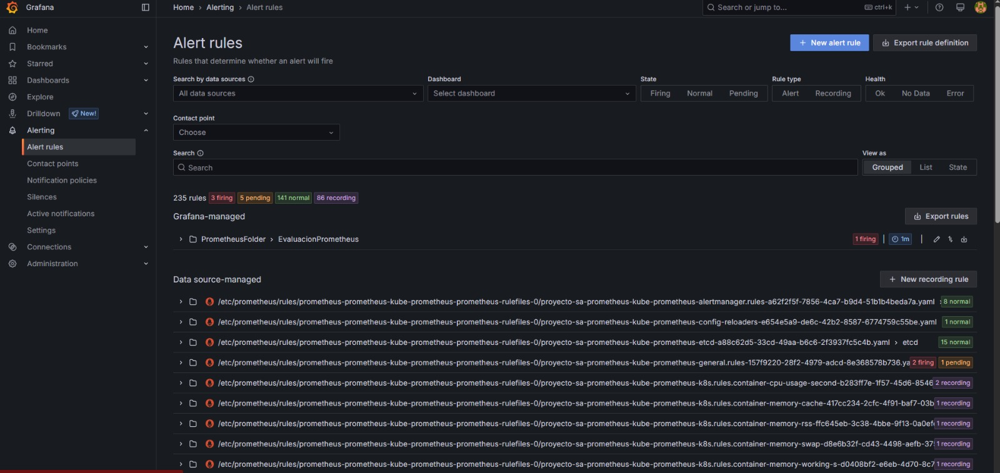

Se le pondrán los parametros para lo que son las alertas para el caso que se quiera o se requiera

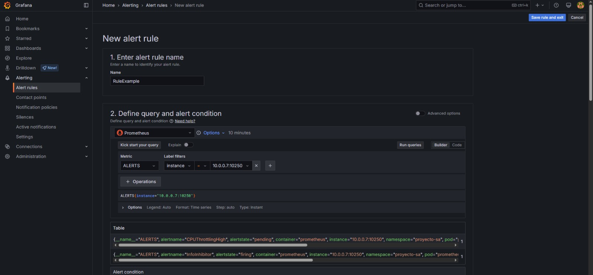

Tendrémos tambien la parte para el foter y la evaluación (generalmente o preferiblemente depending de si creas un folder y una evaluación para un tipo de notificaciones específicas)

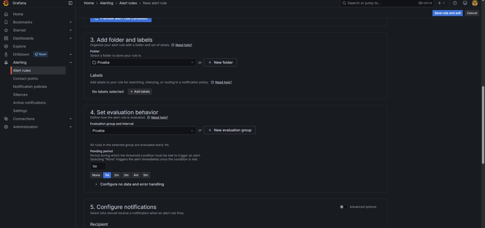

De ahí para las notificaciones se elige el correo al cuál va a enviar la notificación

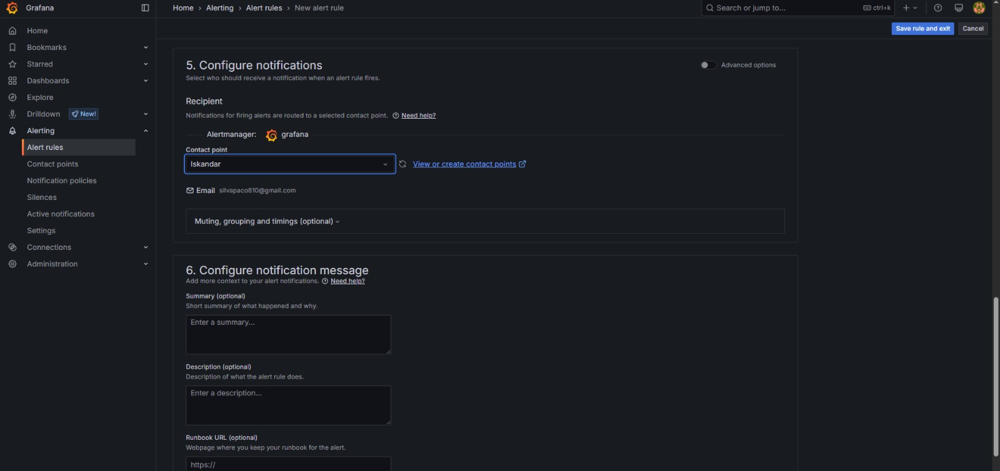

De ahí ya está la regla de alerta creada

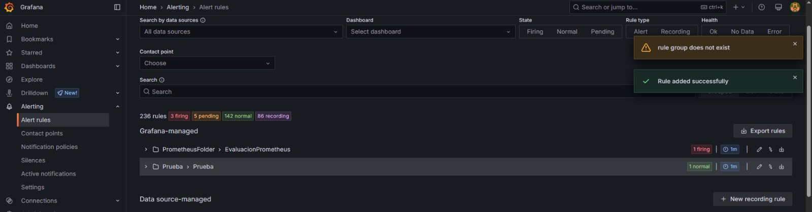

### Kibana


#### Guía de instalación de ElasticSearch, Kibana y Fluentd

Esta guía describe los pasos necesarios para instalar y configurar ElasticSearch, Kibana y Fluentd en un entorno de Kubernetes. A continuación, se detalla la configuración de los archivos YAML necesarios y los comandos requeridos para implementar estos servicios.

---

##### Instalación de ElasticSearch

ElasticSearch es un motor de búsqueda y análisis distribuido que almacena y organiza los datos enviados por Fluentd. En esta configuración, utilizamos un StatefulSet para garantizar la persistencia de datos y la identificación de los nodos en el clúster.

##### Requisitos previos

1. **Entorno de Kubernetes**: Asegúrese de tener un clúster Kubernetes operativo y que `kubectl` esté configurado.
2. **Requerimientos del sistema**: Configure su sistema para cumplir con los requerimientos de ElasticSearch:
    - Ajuste `vm.max_map_count` a `262144`.
    - Aumente los límites de descriptores de archivo (ulimit).
3. **Espacio de almacenamiento**: ElasticSearch requiere almacenamiento persistente para sus datos. Asegúrese de que su entorno tenga suficiente capacidad.

##### Configuración del StatefulSet

El StatefulSet se configura para tener tres réplicas y asegurar la persistencia de datos utilizando PersistentVolumeClaims. Algunos puntos clave incluyen:

- `cluster.name`: Define el nombre del clúster, por ejemplo, `k8s-logs`.
- `ES_JAVA_OPTS`: Establece límites de memoria para la JVM.
- `discovery.seed_hosts`: Permite que los nodos se descubran entre sí.

Ejemplo del archivo YAML:

```yaml
apiVersion: apps/v1
kind: StatefulSet
metadata:
  name: elasticsearch
spec:
  replicas: 3
  selector:
    matchLabels:
      app: elasticsearch
  serviceName: "elasticsearch"
  template:
    metadata:
      labels:
        app: elasticsearch
    spec:
      initContainers:
      - name: sysctl
        image: busybox
        command: ["sh", "-c", "sysctl -w vm.max_map_count=262144"]
      containers:
      - name: elasticsearch
        image: docker.elastic.co/elasticsearch/elasticsearch:7.14.0
        env:
        - name: discovery.seed_hosts
          value: "elasticsearch-0,elasticsearch-1,elasticsearch-2"
        - name: cluster.name
          value: "k8s-logs"
        - name: ES_JAVA_OPTS
          value: "-Xms1g -Xmx1g"
```

#### Configuración del servicio

El servicio actúa como un Headless Service para garantizar la comunicación interna entre nodos. Exponerá los puertos 9200 (REST) y 9300 (comunicación interna).

Ejemplo del archivo YAML:

```yaml
apiVersion: v1
kind: Service
metadata:
  name: elasticsearch
spec:
  clusterIP: None
  ports:
  - port: 9200
    name: rest
  - port: 9300
    name: transport
  selector:
    app: elasticsearch
```

---

## Instalación de Kibana

Kibana proporciona la interfaz gráfica para analizar los datos almacenados en ElasticSearch.

### Configuración del Deployment

El Deployment define una instancia de Kibana configurada para conectarse al clúster ElasticSearch. Configuraciones clave:

- `ELASTICSEARCH_URL`: URL del servicio ElasticSearch.
- Recursos: Define límites de CPU y memoria.

Ejemplo del archivo YAML:

```yaml
apiVersion: apps/v1
kind: Deployment
metadata:
  name: kibana
spec:
  replicas: 1
  selector:
    matchLabels:
      app: kibana
  template:
    metadata:
      labels:
        app: kibana
    spec:
      containers:
      - name: kibana
        image: docker.elastic.co/kibana/kibana:7.14.0
        env:
        - name: ELASTICSEARCH_URL
          value: "http://elasticsearch:9200"
        ports:
        - containerPort: 5601
```

### Configuración del servicio

El servicio expone Kibana en el puerto 5601 mediante LoadBalancer, permitiendo el acceso externo.

Ejemplo del archivo YAML:

```yaml
apiVersion: v1
kind: Service
metadata:
  name: kibana
spec:
  selector: 
    app: kibana
  type: LoadBalancer  
  ports:
    - port: 5601
      targetPort: 5601 
      nodePort: 30000
```

---

## Instalación de Fluentd

Fluentd recopila logs de los nodos del clúster y los envía a ElasticSearch.

### Configuración del ClusterRole y ClusterRoleBinding

Permiten que Fluentd acceda a los recursos del clúster.

Ejemplo del archivo YAML:

```yaml
apiVersion: rbac.authorization.k8s.io/v1
kind: ClusterRole
metadata:
  name: fluentd
rules:
- apiGroups: [""]
  resources: ["pods", "namespaces"]
  verbs: ["get", "list", "watch"]
```

```yaml
apiVersion: rbac.authorization.k8s.io/v1
kind: ClusterRoleBinding
metadata:
  name: fluentd
roleRef:
  apiGroup: rbac.authorization.k8s.io
  kind: ClusterRole
  name: fluentd
subjects:
- kind: ServiceAccount
  name: fluentd
  namespace: default
```

### Configuración del DaemonSet

El DaemonSet asegura que Fluentd se ejecute en cada nodo del clúster.

Ejemplo del archivo YAML:

```yaml
apiVersion: apps/v1
kind: DaemonSet
metadata:
  name: fluentd
spec:
  selector:
    matchLabels:
      app: fluentd
  template:
    metadata:
      labels:
        app: fluentd
    spec:
      serviceAccountName: fluentd
      containers:
      - name: fluentd
        image: fluent/fluentd-kubernetes-daemonset:v1.11
        env:
        - name: FLUENT_ELASTICSEARCH_HOST
          value: "elasticsearch"
        - name: FLUENT_ELASTICSEARCH_PORT
          value: "9200"
        - name: FLUENT_ELASTICSEARCH_SCHEME
          value: "http"
```

---

## Comandos para la instalación

### ElasticSearch

```bash
kubectl create -f ./Monitoreo/EKL/Elasticsearch.yaml
```

### Kibana

```bash
kubectl create -f ./Monitoreo/EKL/Kibana.yaml
```

### Fluentd

```bash
kubectl create -f ./Monitoreo/EKL/Fluent.yaml
```

## Manual técnico de Kibana

Kibana es una herramienta fundamental para la visualización y análisis de datos dentro del ecosistema Elastic Stack. Este manual está diseñado para explicar paso a paso en su configuración y uso, desde la gestión de índices hasta la creación de dashboards interactivos.

### 1. Iniciar sesión en Kibana

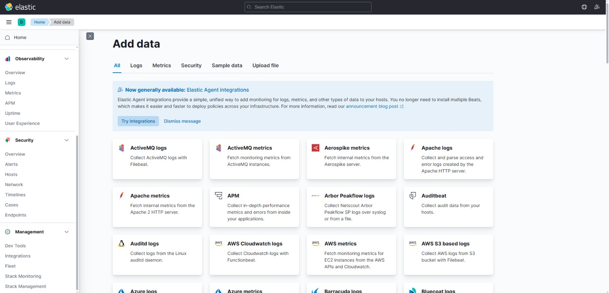

Para comenzar, es necesario iniciar sesión en Kibana mediante la URL configurada en el clúster, en este caso, `<ip>:5601`. Este paso conecta al usuario con el entorno de trabajo, permitiendo acceder a las herramientas y funcionalidades que ofrece Kibana para la visualización y gestión de datos.

### 2. Uso de Stack Management previo a crear un index-pattern

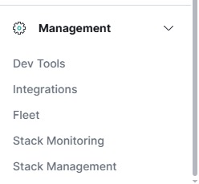

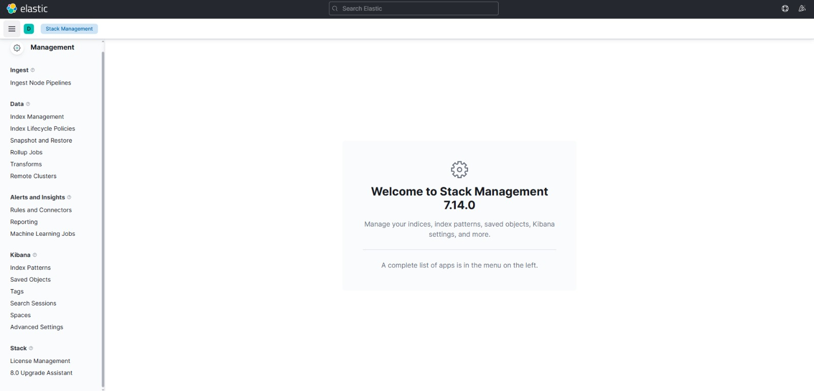

Una vez dentro, seleccionamos la opción `Stack Management`. Desde aquí se gestiona la configuración del sistema, incluyendo la administración de índices, usuarios y configuraciones relacionadas.

### 3. Creación de un index-pattern

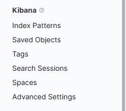

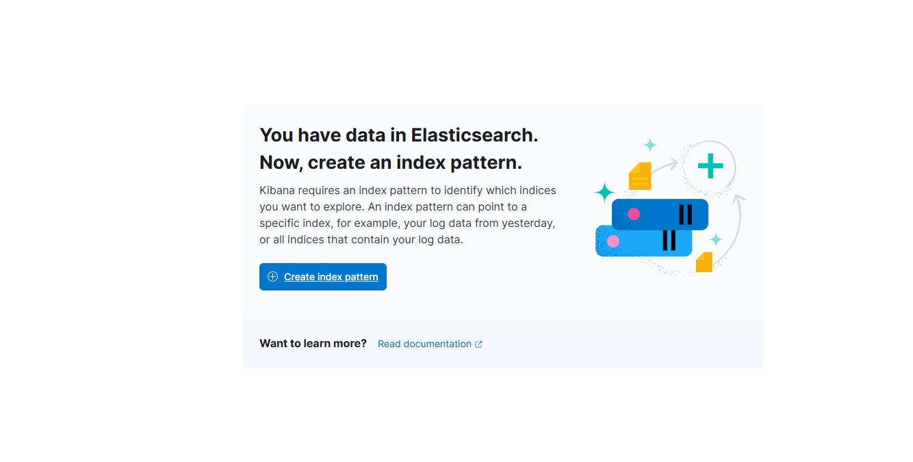

El siguiente paso es crear un index pattern, que actúa como un puente entre los datos almacenados en Elasticsearch y las herramientas de visualización de Kibana. 

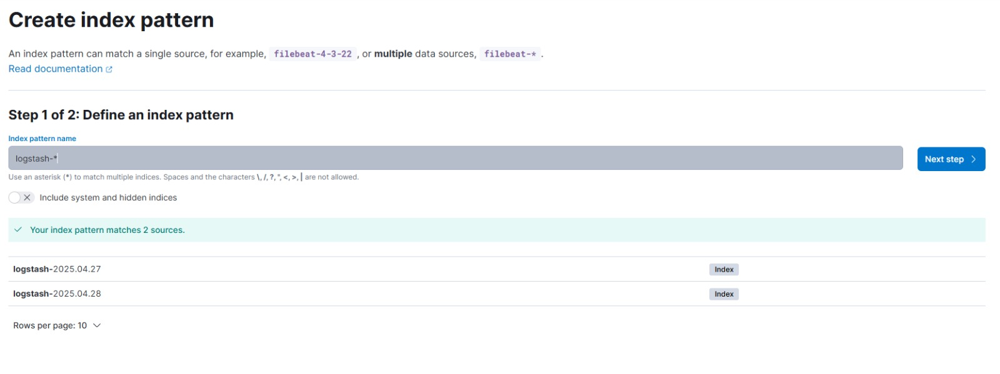

En este caso, utilizamos el patrón `logstash-*`, que agrupa todos los índices relacionados bajo este prefijo. Esto permite acceder a los datos de manera eficiente y los organiza en un formato compatible con las herramientas analíticas de Kibana.

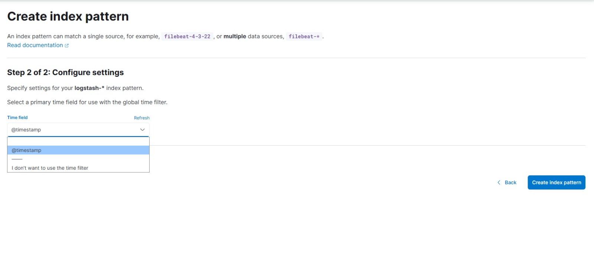

Un index pattern es fundamental para estructurar la información que luego se presentará en los dashboards y visualizaciones.

### 4. Creación de dashboards

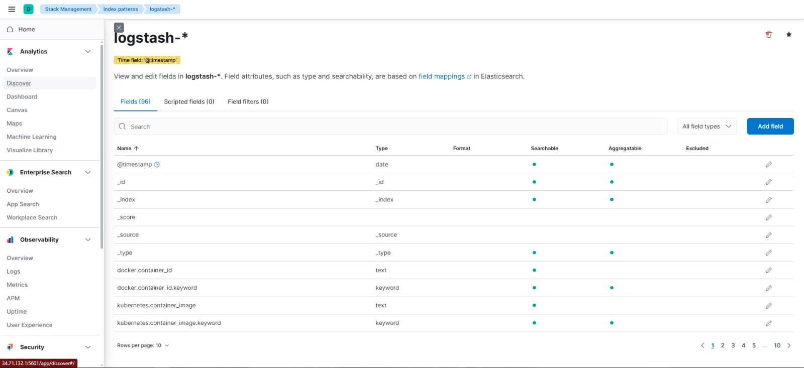

Para explorar los datos y crear visualizaciones, navegamos a la sección `Analytics` y seleccionamos `Discover`. Desde aquí podemos explorar los datos de manera dinámica y en tiempo real.

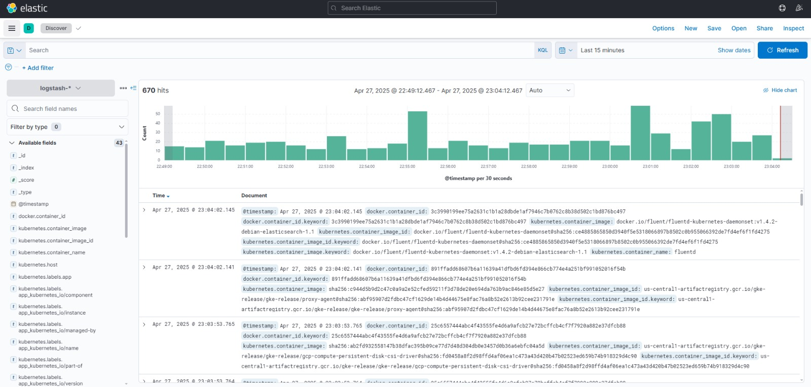

Seleccionamos el tipo de gráfica que se necesite y utilizamos la funcionalidad de `filters` para enfocar el análisis en los datos más relevantes. Los dashboards permiten combinar múltiples visualizaciones, proporcionando una vista integral de la información para facilitar la toma de decisiones basadas en datos.

## Funcionalidades de Monitoreo y Registro con Prometheus y Gragana

### Monitoreo con Prometheus

#### Recolección de Métricas

- Modelo de extracción (pull): Prometheus recupera métricas de los objetivos configurados a intervalos regulares</br>
- Múltiples formatos soportados: Prometheus exposition format, StatsD, Graphite, etc.</br>
- Detección automática de servicios: Integración con Kubernetes, Consul y otros sistemas de descubrimiento</br>

#### Tipos de Métricas

- Contadores: Valores que solo aumentan (HTTP)
- Gauges: Valores que pueden subir o bajar (uso de memoria)</br>
- Histogramas: Muestreo de observaciones en buckets configurables</br>
- Resúmenes: Similar a histogramas pero con percentiles precalculados</br>

#### Configuración de Alertas

- Alertmanager: Componente separado para gestión de alertas</br>
- Reglas de alerta: Definidas en archivos YAML con expresiones PromQL</br>
- Condiciones de alerta: Basadas en umbrales, ausencia de datos, tasas de cambio</br>
- Agrupación de alertas: Reduce la duplicación y el ruido</br>
- Inhibición: Suprime alertas cuando otras ya están activas</br>
- Silenciamiento: Desactiva alertas temporalmente</br>

```yaml
groups:
- name: example
  rules:
  - alert: HighRequestLatency
    expr: job:request_latency_seconds:mean5m{job="myjob"} > 0.5
    for: 10m
    labels:
      severity: page
    annotations:
      summary: High request latency on {{ $labels.instance }}
```

#### Lenguaje de Consulta (PromQL)

- Consultas flexibles para agregación, filtrado y análisis de series temporales</br>
- Funciones matemáticas, estadísticas y de predicción</br>
- Operadores para combinar múltiples métricas</br>

### Visualización con Grafana

#### Creación de Paneles

- Variedad de visualizaciones: Gráficos, tablas, gauges, heatmaps, etc.</br>
- Editores visuales: Arrastrar y soltar para diseñar paneles</br>
- Templates de variables: Para paneles interactivos y reutilizables</br>
- Anotaciones: Marcas temporales para eventos importantes</br>

#### Tipos de Paneles Comunes

- Paneles de Estado:</br>
  - Muestran el estado actual de servicios</br>
  - Uso de indicadores de color (verde/rojo)</br>
- Paneles de Tendencia:</br>
  - Gráficos de series temporales</br>
  - Comparación de períodos</br>
- Paneles de Capacidad:</br>
  - Uso de recursos (CPU, memoria, disco)</br>
  - Predicciones de capacidad</br>
- Paneles de Negocio:</br>
  - Métricas de rendimiento empresarial</br>
  - Conversión de usuarios, ingresos</br>

#### Características Avanzadas

Alertas en Grafana: Configuración directa de alertas basadas en umbrales</br>
Plugins: Amplia biblioteca de plugins para fuentes de datos y paneles</br>
Dashboards como código: Exportación/importación en formato JSON</br>
Organización en carpetas: Para clasificar paneles por equipo/proyecto</br>

```json
{
  "title": "Uso de CPU",
  "type": "graph",
  "datasource": "Prometheus",
  "targets": [
    {
      "expr": "100 - (avg by(instance) (irate(node_cpu_seconds_total{mode='idle'}[5m])) * 100",
      "legendFormat": "{{instance}}"
    }
  ],
  "options": {
    "yaxes": [
      {
        "format": "percent",
        "min": 0,
        "max": 100
      }
    ]
  }
}
```

### Integración entre Prometheus y Grafana

- Grafana puede usar Prometheus como fuente de datos</br>
- Consultas PromQL ejecutadas directamente desde Grafana</br>
- Paneles de Grafana pueden incluir enlaces a las expresiones en Prometheus</br>