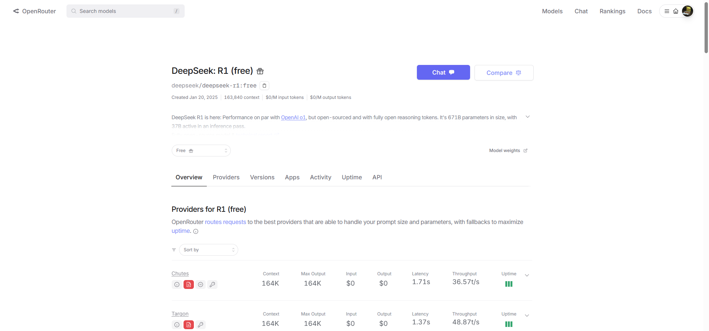
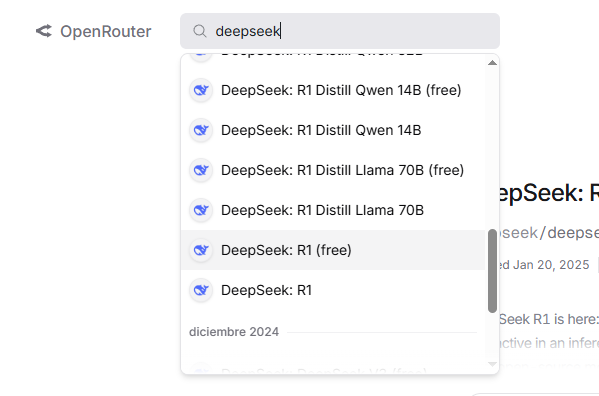
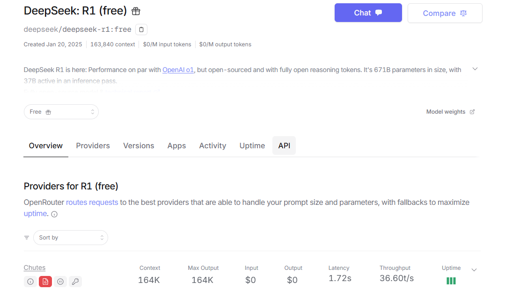
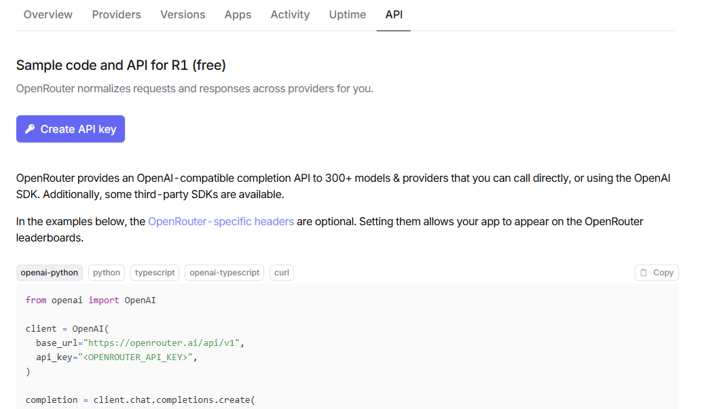
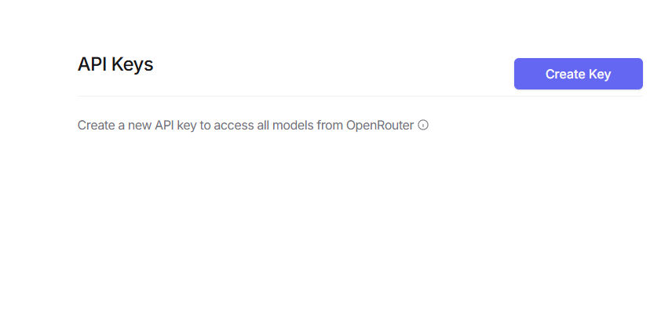
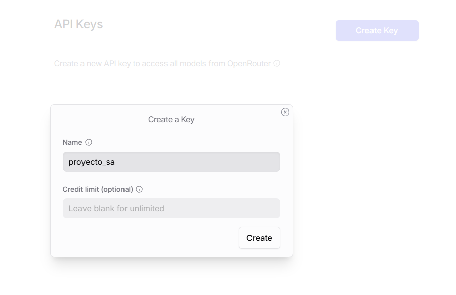
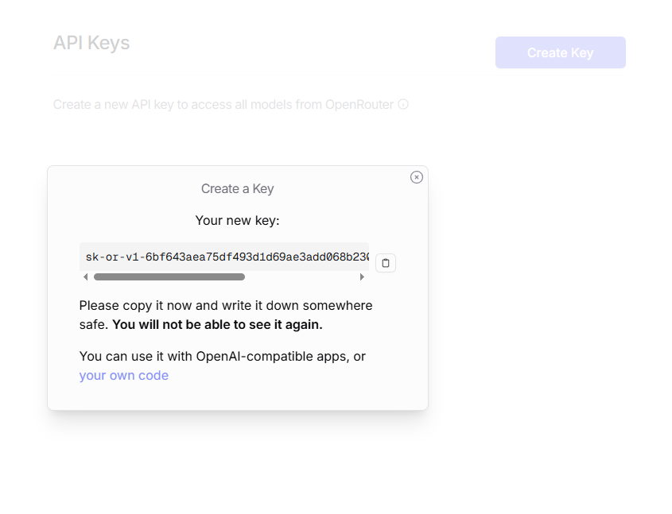
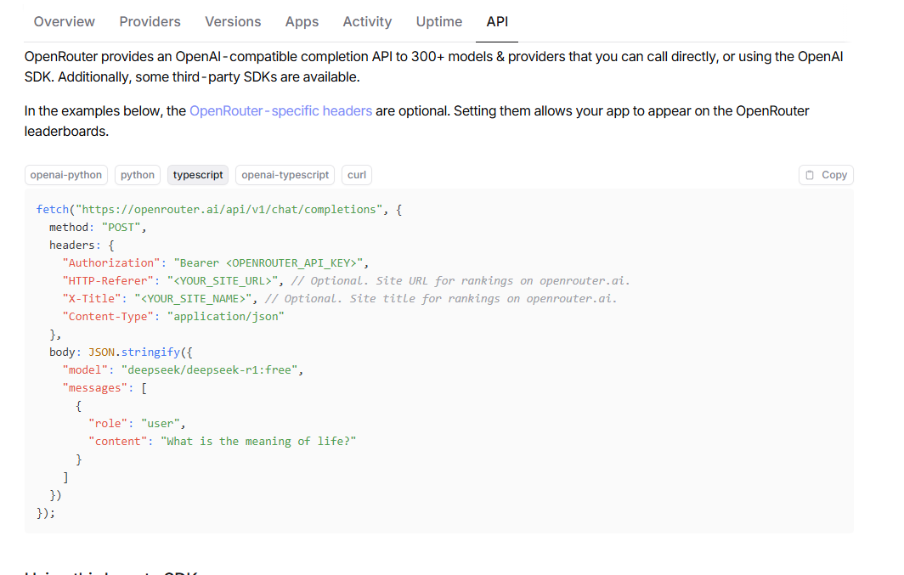
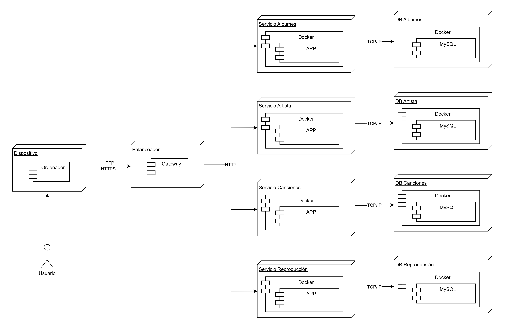
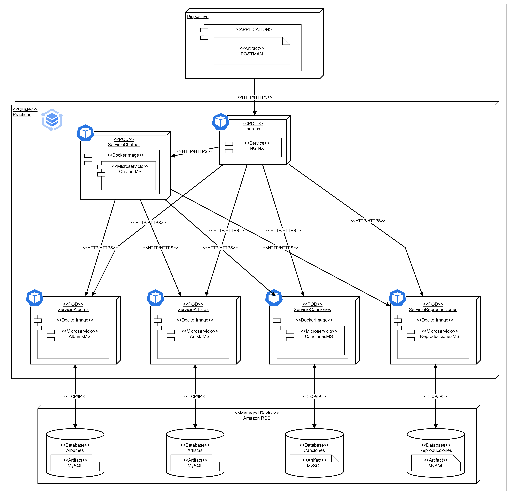

# Documentación

## Descripción detallada de la herramienta utilizada (Chatbot con DeepSeek R1):

### Funcionalidades clave:

* Consumo de datos a través de DeepSeek R1: El chatbot se comunica con la API de DeepSeek R1 para obtener información sobre playlists, canciones, artistas y álbumes. Esta API permite acceder a grandes volúmenes de datos relacionados con música, proporcionando información detallada y precisa. 
* Consultas personalizadas con DeepSeek R1: 
  * La API permite realizar consultas específicas sobre las playlists, artistas y álbumes del usuario. 
  * REST y GraphQL pueden ser utilizados para hacer solicitudes más complejas y obtener respuestas detalladas. 
* Filtrado inteligente de resultados: DeepSeek R1 ofrece capacidades de búsqueda avanzada, lo que permite al chatbot procesar consultas más complejas y entregar respuestas específicas, como listas de canciones por género, por artista, o incluso recomendaciones personalizadas. 
* Interacción en tiempo real: El chatbot puede proporcionar respuestas en tiempo real basadas en los datos actualizados de DeepSeek R1, lo que mejora la experiencia del usuario al acceder a la información más reciente. 
* Escalabilidad y rendimiento: Dado que DeepSeek R1 está optimizado para manejar grandes cantidades de datos, el chatbot puede escalar fácilmente para gestionar muchas consultas simultáneamente sin afectar el rendimiento. 

### Precios:
* Los precios de la API DeepSeek R1 dependen de los planes que ofrezca la plataforma, que suelen estar basados en el volumen de consultas o en el número de usuarios activos. 
* Los planes más comunes suelen incluir: 
  * Plan Básico (Gratis): Con un número limitado de consultas por mes o funcionalidades básicas. 
  * Planes de Pago: Precios escalonados según el número de consultas mensuales o el uso avanzado de funcionalidades como búsquedas complejas, acceso a datos históricos, etc. 

### Restricciones:
* Acceso a funciones avanzadas: Algunas funciones avanzadas de búsqueda o análisis pueden estar limitadas a planes de pago. 
* Requisitos de autenticación: La API de DeepSeek R1 generalmente requiere autenticación mediante tokens de acceso que deben ser gestionados adecuadamente para evitar problemas de acceso o limitaciones. 

# Manual de uso del chatbot con DeepSeek R1
## Configuración inicial:

* Autenticación: Asegúrate de que el chatbot esté correctamente autenticado con la API de DeepSeek R1. Esto implica obtener el API key y configurarlo en el backend del chatbot para hacer las peticiones necesarias. 
* Integración con microservicios: El chatbot debe estar conectado al servicio de DeepSeek R1 para poder consultar información sobre playlists, artistas, álbumes y canciones. 

## Interacción con el chatbot:

El chatbot utilizará la API de DeepSeek R1 para proporcionar respuestas sobre la música. Algunos ejemplos de cómo interactuar con el chatbot son:

* Inputs de ejemplo: 
  * Consulta de canciones disponibles: 
    * Usuario: "¿Cuántas canciones hay?" 
    * Chatbot: "Actualmente hay 1,542 canciones disponibles en nuestra base de datos." 
* Consulta de playlists: 
  * Usuario: "¿Qué playlists tengo guardadas?" 
  * Chatbot: "📋 Aquí tienes la lista de todas tus playlists guardadas: (muestra la lista) 
* Comandos avanzados: 
  * Crear playlist: 
    * Usuario: "Crear playlist llamada 'Mi música favorita'." 
    * Chatbot: "La playlist 'Mi música favorita' ha sido creada exitosamente." 
  * Agregar canción a playlist: 
    * Usuario: "Añadir 'Beat It' de Michael Jackson a 'Mi música favorita'." 
    * Chatbot: "'Beat It' ha sido agregada a tu playlist 'Mi música favorita'." 

## Mensajes de error:

Si el usuario ingresa un comando no reconocido o hay un error en la consulta, el chatbot responderá con un mensaje de error.

> Ejemplo de mensaje de error:

* Usuario: "Añadir canción sin nombre." 
* Chatbot: "Lo siento, no puedo agregar una canción sin nombre. Por favor, proporciona el nombre de la canción." 

## Logs y seguimiento:
Si el chatbot encuentra algún problema con el consumo de servicios, se recomienda monitorear los logs generados en el backend para identificar posibles fallas.

## Configuración chatbot

* Ingresaremos a la página de OpenRouter para crear cuenta

* Vamos a buscar el modelo que queremos usar

* En API vamos a crear una API Key para conectar la aplicación de js con el chatbot

* Una vez creada la llave se utiliza y o modifica el código de la api que dan para ajustarlo

## Arquitectura

* Inicial (practicas pasadas)

* Diagrama ya de la nube

* Diagrama Actualizado (Final)

